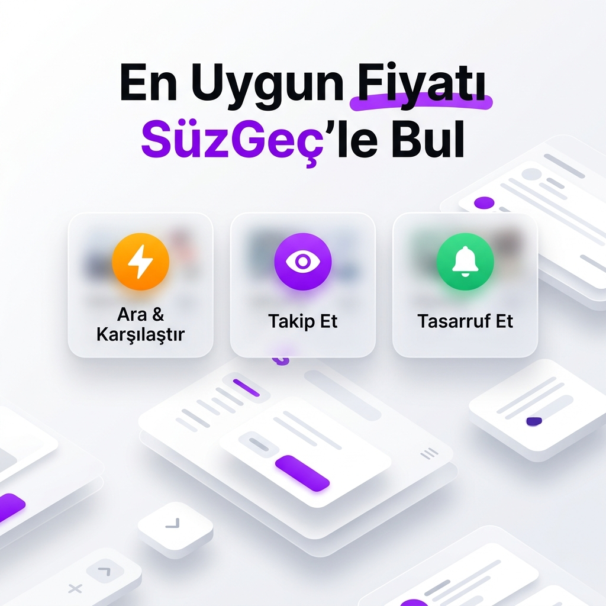

# Süz-Geç


---

## Proje Hakkında



**Proje Tanımı:** 

Akıllı fiyat karşılaştırma ve stok takip platformumuz Süzgeç, alışveriş deneyimini tamamen optimize etmek ve kullanıcıların en doğru kararı vermesini sağlamak amacıyla tasarlanmış modern bir dijital asistandır. Sistem; onlarca farklı e-ticaret sitesinden ürün verilerini anlık olarak analiz ederek, kullanıcıya gerçek zamanlı bir fiyat haritası sunar.

Süzgeç, yalnızca bir arama motoru olmanın ötesine geçerek; kullanıcıların bütçe hedeflerine, takip listelerine ve kişisel tercihlerine göre özelleştirilmiş bir süreç yönetimi sağlar. Uygulama, karmaşık fiyat dalgalanmalarını takip etmek zorunda kalan kullanıcılar için fiyat geçmişi grafiklerini, stok alarmlarını ve hedef fiyat bildirimlerini tek bir merkezden sunar. Ayrıca kullanıcı dostu arayüzü sayesinde ürünleri teknik özelliklerine ve fiyat/performans dengesine göre kolayca karşılaştırma imkanı tanır.

Bu bütünleşik yapı sayesinde kullanıcılar; zaman kaybetmeden, bütçelerine en uygun ürüne, en güvenilir satıcıdan ulaşabilirler. Süzgeç; dinamik, hızlı ve güvenilir altyapısıyla alışverişin her anında kullanıcının yanında olan kapsamlı bir ekosistemdir

**Proje Kategorisi:** 
> Alışveriş

**Referans Uygulama:** 
> 

---

## Proje Linkleri

- **REST API Adresi:** [suzgecbackend.vercel.app](https://suzgecbackend.vercel.app/)
- **Web Frontend Adresi:** [suzgec.vercel.app](https://suzgec.vercel.app/)

---

## Proje Ekibi

**B²E** 


**Ekip Üyeleri:** 
- Berk Mutlu
- Berra Kırış
- Eda Nur Tarhan

---

## Kullanılan Teknolojiler

| Katman | Teknoloji |
|--------|-----------|
| **Web Frontend** | Next.js 16, React 19, Tailwind CSS, shadcn/ui, Framer Motion |
| **Mobil Uygulama** | React Native (Expo 54), TypeScript |
| **Backend API** | Node.js, Express.js |
| **Veritabanı** | MongoDB Atlas (Mongoose ODM) |
| **Önbellek** | Redis (ioredis) — API sonuç önbellekleme, JWT kara listeleme |
| **Mesaj Kuyruğu** | RabbitMQ (amqplib) — Asenkron bildirim işleme |
| **Konteynerizasyon** | Docker, Docker Compose |
| **CI/CD** | Jenkins Pipeline |
| **Deployment** | Vercel (Production), Docker (Lokal) |
| **Yapay Zeka** | Google Gemini API (ürün karşılaştırma) |

---

## Docker ile Çalıştırma

Projeyi Docker ile lokalde çalıştırmak için:

```bash
# Tüm servisleri başlat (MongoDB, Redis, RabbitMQ, Backend, Frontend)
docker-compose up -d

# Servislerin durumunu kontrol et
docker-compose ps

# Logları izle
docker-compose logs -f

# Servisleri durdur
docker-compose down
```

**Servis Adresleri (Docker):**
| Servis | Adres |
|--------|-------|
| Backend API | http://localhost:5000 |
| Web Frontend | http://localhost:3000 |
| RabbitMQ Yönetim Paneli | http://localhost:15672 (guest/guest) |
| MongoDB | localhost:27017 |
| Redis | localhost:6379 |

---

## Dokümantasyon

Proje dokümantasyonuna aşağıdaki linklerden erişebilirsiniz:

1. [Gereksinim Analizi](Gereksinim-Analizi.md)
2. [REST API Tasarımı](API-Tasarimi.md)
3. [REST API](Rest-API.md)
4. [Web Front-End](WebFrontEnd.md)
5. [Mobil Front-End](MobilFrontEnd.md)
6. [Mobil Backend](MobilBackEnd.md)
7. [Video Sunum](Sunum.md)
---